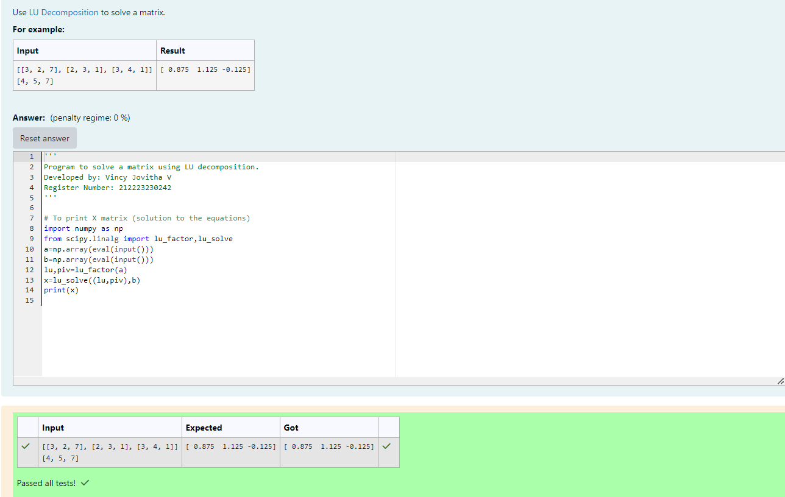

# LU Decomposition 

## AIM:
To write a program to find the LU Decomposition of a matrix.

## Equipments Required:
1. Hardware – PCs
2. Anaconda – Python 3.7 Installation / Moodle-Code Runner

## Algorithm
1. Start the program.
2. Import numpy as np.
3. Using eval get the input matrix.
4. Declare the formula for lu decompostion and obtain the result.
5. End the program.

## Program:
(i) To find the L and U matrix
```
#Program to solve a matrix using LU decomposition.
#Developed by: Vincy Jovitha V
#Register Number: 212223230242


# To print X matrix (solution to the equations)
import numpy as np
from scipy.linalg import lu_factor,lu_solve
a=np.array(eval(input()))
b=np.array(eval(input()))
lu,piv=lu_factor(a)
x=lu_solve((lu,piv),b)
print(x)

```
(ii) To find the LU Decomposition of a matrix
```
#Program to solve a matrix using LU decomposition.
#Developed by: Vincy Jovitha V
#Register Number: 212223230242

# To print X matrix (solution to the equations)
import numpy as np
from scipy.linalg import lu_factor,lu_solve
a=np.array(eval(input()))
b=np.array(eval(input()))
lu,piv=lu_factor(a)
x=lu_solve((lu,piv),b)
print(x)

```

## Output:


(i) To find the L and U matrix


(ii) To find the LU Decomposition of a matrix


## Result:
Thus the program to find the LU Decomposition of a matrix is written and verified using python programming.

